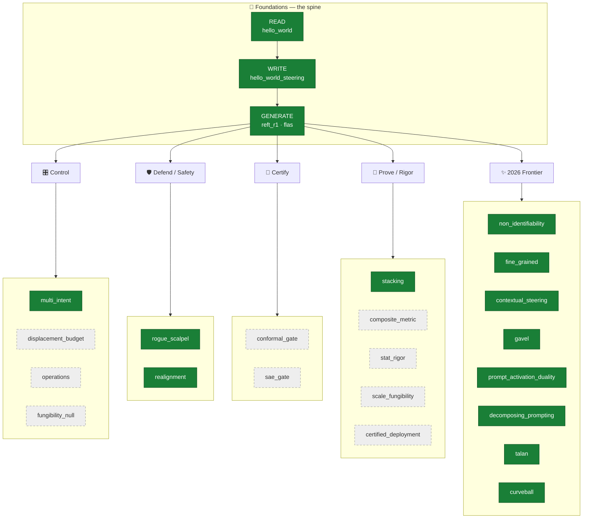
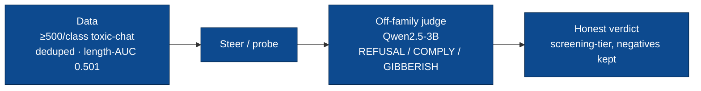

# steering_tutorials

**A progressive, hands-on course in activation steering of LLMs** — learn to
*read*, *write*, and *generate* directions in a language model's residual stream,
on small Gemma models you can run on a single GPU.

By the end you can: **detect** a concept in a model's activations, **steer** its
behavior along a learned direction, **gate** that steering so it fires only when
needed, and **prove** whether it actually worked under an honest, off-family judge.

Every lesson is a self-contained package (code + rigor + demo), independent of the
research harness in `src/steering`, adding **exactly one new idea** at a time.

```bash
pip install -r steering_tutorials/hello_world/requirements.txt
python -m steering_tutorials.reft_r1.run_reft      # run lesson 3 end-to-end
```

Repo: <https://github.com/dlmastery/steeringresearch/tree/master/steering_tutorials>

---

## The learning arc

A three-verb **Foundations** spine (READ → WRITE → GENERATE) that branches into
five themed streams. Solid nodes are **built + validated**; dashed nodes are
**planned**.



Prereqs cascade — each lesson assumes the ones before it — but every package runs
on its own (it re-derives or imports what it needs from earlier lessons).

---

## Lessons by theme

### 🧭 Foundations — the READ → WRITE → GENERATE spine

| Lesson | Teaches | Status |
|---|---|---|
| [`hello_world`](hello_world/README.md) · READ | linear/shallow probing of activations for a concept (harm) | ✅ built + validated |
| [`probe_tuning`](probe_tuning/README.md) · READ+ | layer sweep + MLP hyperparameter search (CV, no test peeking) | ✅ built + validated |
| [`hello_world_steering`](hello_world_steering/README.md) · WRITE | CAA/diff-of-means steering vector, conditional gating, an LLM judge | ✅ built + validated |
| [`reft_r1`](reft_r1/README.md) · GENERATE | AxBench's learned rank-1 ReFT; ReFT-r1 vs DiffMean vs prompting bake-off | ✅ built + validated |
| [`flas`](flas/README.md) · GENERATE+ | flow-based steering: a concept-conditioned velocity field; flow-time = strength dial | ✅ built + validated |

### ✨ 2026 Frontier — recent-paper reproductions

| Lesson | Teaches | Status |
|---|---|---|
| [`non_identifiability`](non_identifiability/README.md) | steering vectors aren't unique — many low-cosine directions, same effect (arXiv:2602.06801) | ✅ built |
| [`fine_grained`](fine_grained/README.md) | sparse (top-k%) edits vs dense — "steering less" (inspired by AUSteer, arXiv:2602.04428) | ✅ built |
| [`contextual_steering`](contextual_steering/README.md) | per-input adaptive steering strength (inspired by CLAS, arXiv:2604.24693) | ✅ built |
| [`gavel`](gavel/README.md) | vocabulary-projection concept selection for steering directions (arXiv:2601.19768) | ✅ built |
| [`prompt_activation_duality`](prompt_activation_duality/README.md) | when a prompt and an activation edit are interchangeable — and when they aren't (arXiv:2605.10664) | ✅ built |
| [`decomposing_prompting`](decomposing_prompting/README.md) | splitting a prompt's effect into additive activation components (arXiv:2606.03093) | ✅ built |
| [`talan`](talan/README.md) | labelled inference-time bottleneck-adapter analogue of a post-training method (arXiv:2606.06902) | ✅ built |
| [`curveball`](curveball/README.md) | curved (great-circle geodesic) vs straight-chord steering at matched budget (arXiv:2603.09313) | ✅ built |

### 🎛 Control — when, how far, and how to steer

| Lesson | Teaches | Status |
|---|---|---|
| [`multi_intent`](multi_intent/README.md) · L9 | steer K concepts at once; orthogonalization; the norm budget | ✅ built + validated |
| `displacement_budget` · L4 | the coherence cliff; bound off-manifold displacement | ⏳ planned |
| `operations` · L5 | add vs project-out (ablation) vs rotate (norm-preserving) | ⏳ planned |
| `fungibility_null` · L6 | direction controls: shuffled/random/orthogonal — is the vector special? | ⏳ planned |

### 🛡 Defend — adversarial robustness & safety

| Lesson | Teaches | Status |
|---|---|---|
| [`rogue_scalpel`](rogue_scalpel/README.md) · L10 | red-team the guard: the universal attack + the five-layer defense | ✅ built + validated |
| [`realignment`](realignment/README.md) · L11 | restore refusal in an abliterated model by transplanting a direction | ✅ built + validated |

### 📜 Certify — provable guarantees

| Lesson | Teaches | Status |
|---|---|---|
| `conformal_gate` · L7 | conformal prediction → a provable benign over-refusal bound | ⏳ planned |
| `sae_gate` · L8 | interpretable SAE-feature gates with human-readable firing reasons | ⏳ planned |

### 🔬 Prove — rigor, composition & scale

| Lesson | Teaches | Status |
|---|---|---|
| [`stacking`](stacking/README.md) · L12 | which priors stack (orthogonal sites) vs compete (same site) | ✅ built + validated |
| `composite_metric` · L13 | the Goodhart-resistant multi-objective score; Pareto fronts | ⏳ planned |
| `stat_rigor` · L14 | screening vs evaluation; Wilcoxon + bootstrap + Holm-Bonferroni; HARKing | ⏳ planned |
| `scale_fungibility` · L15 | does the direction start to matter at 9B? endogenous steering resistance | ⏳ planned (A100) |
| `certified_deployment` · L16 | certified gate vs a classifier-router under attack — the capstone | ⏳ planned |

---

## Honest results

> **The through-line:** *learned* interventions survive a real judge on hard data;
> *simple fixed* diff-of-means vectors largely don't — and the earlier rosy numbers
> were inflated by a tiny 1B self-judge + easy in-distribution JailbreakBench.
> Reported as they landed, negatives included. Numbers are **screening-tier**
> (n ≈ 50–175/class depending on lesson), Qwen judge, 500/class toxic-chat
> (2026-07-16 honest re-run).

**Strongest rows:**

| Lesson | Honest result |
|---|---|
| [`reft_r1`](reft_r1/README.md) · GENERATE | **reproduces AxBench**: learned **ReFT-r1 0.54 > DiffMean 0.26 > prompting 0.18** steering; DiffMean wins detection (AUC 0.71 vs 0.61) |
| [`realignment`](realignment/README.md) · DEFEND | **works** — clean α=0.2 operating point: **ASR 0.47→0.00**, over-refusal 0.00, coherence 0.85 |
| [`rogue_scalpel`](rogue_scalpel/README.md) · DEFEND | attack strips refusal **0.52→0.00**; the **norm-clamp guard recovers it (0.60)**; lock/dual guards don't |
| [`hello_world`](hello_world/README.md) · READ | probe 5-fold CV **0.87 ± 0.03**; leakage clean; XSTest OOD AUC 0.89 |
| [`hello_world_steering`](hello_world_steering/README.md) · WRITE | **fixed steering barely works** (n=175/arm): refusal *falls* 0.33→0.07 as α rises, gibberish 0.21→**0.69** — the honest negative |

The remaining built lessons (`flas`, `non_identifiability`, `fine_grained`,
`contextual_steering`, `multi_intent`, `stacking`, `probe_tuning`) each report
their measured-vs-claimed verdict in their own `README.md` — including the ones
that deflated under the honest judge. See per-lesson pages for the full picture.

---

## Rigor & honesty (the measurement stack)



> - **Data** — shared ≥500 harmful + ≥500 benign set (`common/data.py`), 100%
>   lmsys/toxic-chat, deduped, **length-matched (length-AUC 0.501)** so no probe or
>   vector can cheat on length.
> - **Judge** — an **off-family Qwen2.5-3B** grades outputs (`STEER_JUDGE_MODEL`).
>   The tutorials' tiny **1B self-judge inflates refusal**, so all headline numbers
>   use the Qwen judge.
> - **Papers** — an independent auditor per lesson (`AUDIT.md`) WebFetch-verified
>   every cited arXiv ID and fixed attribution errors.
> - **Tier** — numbers are **screening-tier** (n ≈ 50/class), labelled as such.

Each lesson links to its `AUDIT.md` and `artifacts/results.json` + plots.

---

## Run any lesson

From the repo root:

```bash
pip install -r steering_tutorials/hello_world/requirements.txt
python -m steering_tutorials.<lesson>.<script>   # e.g. steering_tutorials.hello_world.train_probe
```

Each lesson's own `README.md` carries its concepts, code walkthrough, run commands,
`## Results — measured vs. the claim`, and honest caveats. Course-wide standards:
full metric suite with CIs, a leakage/confound audit on every dataset, out-of-domain
checks, principled dataset sampling, fixed seeds, and degradations reported as
prominently as wins.

Repo: <https://github.com/dlmastery/steeringresearch/tree/master/steering_tutorials>
